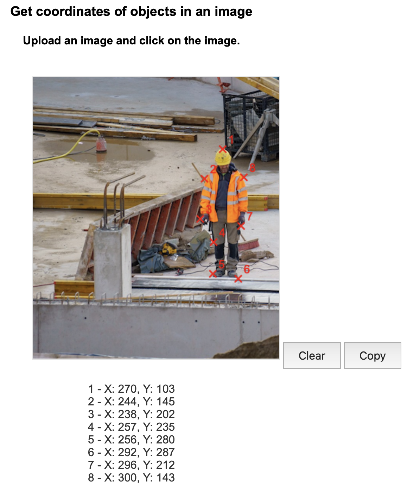

# Image Coordinates Viewer

## Overview

This project is a simple HTML and JavaScript-based tool that allows users to upload an image, click on it, and get the (X, Y) coordinates of the clicked points. It also provides functionality to copy the list of clicked coordinates to the clipboard.

## Features

- Image Upload: Upload PNG or JPEG images using a file input.
- Click to Get Coordinates: Click on the uploaded image to display the coordinates of the clicked points.
- Visual Markers: For each click, a red "X" marker is drawn on the image at the clicked location along with a number indicating the order of the clicks.
- Coordinates List: The list of clicked points is displayed with their X and Y coordinates in a side panel.
- Copy to Clipboard: Click a button to copy the coordinates of all points to the clipboard.
- Dynamic Tooltip: Displays the real-time X and Y coordinates as the user moves the mouse over the image.

## License

This project is free to use under the MIT License.